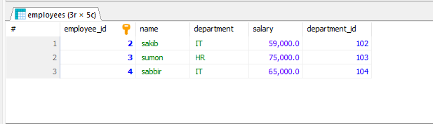

# Lab Report 02
**Course:** Database Management System  (CSEC-322)<br />
**Lab Report On:** Database Creation, Insertion, and Query Execution in SQL <br/>
## Create and Use Database
```sql
CREATE DATABASE lab_report_02;
USE lab_report_02;
```
## Create Tables
```sql
CREATE TABLE employees (
    employee_id INT PRIMARY KEY,
    name VARCHAR(50) NOT NULL,
    department VARCHAR(50),
    salary DECIMAL(10, 2),
    department_id INT);

CREATE TABLE customers (
    customer_id INT PRIMARY KEY,
    name VARCHAR(50) NOT NULL,
    city VARCHAR(50)
);

CREATE TABLE orders (
    order_id INT PRIMARY KEY,
    customer_id INT,
    order_date DATE,
    amount DECIMAL(10, 2),
    FOREIGN KEY (customer_id) REFERENCES customers(customer_id)
);

CREATE TABLE products (
    product_id INT PRIMARY KEY,
    name VARCHAR(50) NOT NULL,
    category_id INT,
    price DECIMAL(10, 2)
);

```

## Insert Sample Data
```sql

Insert sample data into the employees table.
------------------------------------------------

INSERT INTO employees (employee_id,department_id, name, department, salary )
VALUES 
(1, 101, 'sakil','Sales',50000),
(2, 102, 'sakib','IT',59000),
(3, 103, 'sumon','HR',75000),
(4, 104, 'sabbir','IT',65000);

Insert sample data into the customers table.
------------------------------------------------

INSERT INTO customers (customer_id, name, city)
VALUES 
(1, 'sazid', 'Kaligonj'),
(2, 'shimul', 'Mawna'),
(3, 'himel', 'Mymenshing'),
(4, 'sahid', 'Dhaka'),
(5, 'santo', 'Rangpur');

Insert sample data into the orders table.
------------------------------------------------

INSERT INTO orders (order_id, customer_id, order_date, amount)
VALUES 
(101, 1, '2024-01-15', 250),
(102, 2, '2024-02-20', 300),
(103, 3, '2024-03-05', 150),
(104, 1, '2024-04-10', 450);

Insert sample data into the products table.
------------------------------------------------

INSERT INTO products (product_id, name, category_id, price)
VALUES 
(201, 'Laptop', 1, 800),
(202, 'Tablet', 2, 200),
(203, 'Smartphone', 1, 600),
(204, 'Headphones', 4, 100),
(205, 'Monitor', 3, 150),
(206, 'Keyboard', 4, 50);

```

## Question_1: Write a query to select all records from a table where a specific condition is met.
```sql
SELECT * 
FROM employees 
WHERE salary > 50000;
```
### Output of Quesion_1


## Question_2: Average salse performance score of all employees
```sql
SELECT AVG(sales_performance) AS average_sales_performance
FROM performance_reviews;
```
### Output of Quesion_2


## Question_3: Highest customer feedback score
```sql
SELECT MAX(customer_feedback) AS highest_customer_feedback
FROM performance_reviews;
```
### Output of Quesion_3


## Question_4: Total project completion score for each department
```sql
SELECT e_id, SUM(project_completion) AS total_project_completion
FROM performance_reviews
GROUP BY e_id;
```
### Output of Quesion_4


## Question_5: Average sales, customer feedback, and project completion scores for each department
```sql
SELECT d_id,
       (SELECT d_name FROM departments WHERE departments.d_id = employees.d_id) AS department_name,
       AVG(sales_performance) AS average_sales_performance,
       COUNT(r_id) AS total_reviews
FROM employees, performance_reviews
WHERE employees.e_id = performance_reviews.e_id
GROUP BY d_id;

```
### Output of Quesion_5


## Question_6: Find the department with an average sales performance score greater than 80
```sql
SELECT e_id, AVG(sales_performance) AS average_sales_performance
FROM performance_reviews
GROUP BY e_id
HAVING AVG(sales_performance) > 80;
```
### Output of Quesion_6


## Question_7: Count the number of distinct review dates
```sql

SELECT COUNT(DISTINCT review_date) AS distinct_review_dates
FROM performance_reviews;
```
### Output of Quesion_7


## Question_8: List all employee names along with their total number of reviews
```sql
SELECT first_name, last_name, 
       (SELECT COUNT(*) 
        FROM performance_reviews pr 
        WHERE pr.e_id = e.e_id) AS total_reviews
FROM employees e;

```
### Output of Quesion_8


## Question_9: Find the average sales performance and the total number of reviews for each department
```sql
SELECT d.d_name AS department_name,
       (SELECT AVG(pr.sales_performance)
        FROM performance_reviews pr
        WHERE pr.e_id IN (SELECT e.e_id FROM employees WHERE e.d_id = d.d_id)) AS average_sales_performance,
       (SELECT COUNT(*)
        FROM performance_reviews pr
        WHERE pr.e_id IN (SELECT e.e_id  FROM employees e WHERE e.d_id = d.d_id)) AS total_reviews
FROM departments d;
```
### Output of Quesion_9

