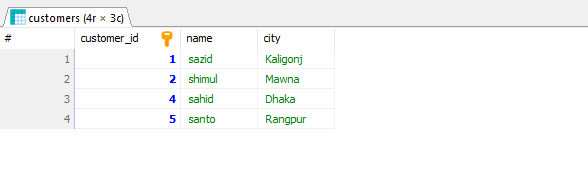
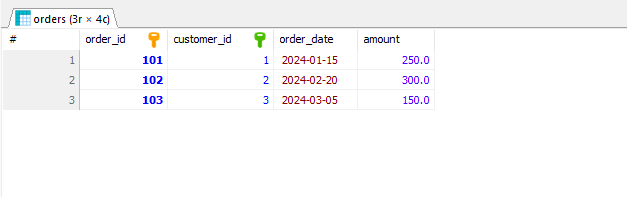

# Lab Report 02
**Course:** Database Management System  (CSEC-322)<br />
**Lab Report On:** Database Creation, Insertion, and Query Execution in SQL <br/>
## Create and Use Database
```sql
CREATE DATABASE lab_report_02;
USE lab_report_02;
```
## Create Tables
```sql
CREATE TABLE employees (
    employee_id INT PRIMARY KEY,
    name VARCHAR(50) NOT NULL,
    department VARCHAR(50),
    salary DECIMAL(10, 2),
    department_id INT);

CREATE TABLE customers (
    customer_id INT PRIMARY KEY,
    name VARCHAR(50) NOT NULL,
    city VARCHAR(50)
);

CREATE TABLE orders (
    order_id INT PRIMARY KEY,
    customer_id INT,
    order_date DATE,
    amount DECIMAL(10, 2),
    FOREIGN KEY (customer_id) REFERENCES customers(customer_id)
);

CREATE TABLE products (
    product_id INT PRIMARY KEY,
    name VARCHAR(50) NOT NULL,
    category_id INT,
    price DECIMAL(10, 2)
);

```

## Insert Sample Data
```sql

Insert sample data into the employees table.
------------------------------------------------

INSERT INTO employees (employee_id,department_id, name, department, salary )
VALUES 
(1, 101, 'sakil','Sales',50000),
(2, 102, 'sakib','IT',59000),
(3, 103, 'sumon','HR',75000),
(4, 104, 'sabbir','IT',65000);

Insert sample data into the customers table.
------------------------------------------------

INSERT INTO customers (customer_id, name, city)
VALUES 
(1, 'sazid', 'Kaligonj'),
(2, 'shimul', 'Mawna'),
(3, 'himel', 'Mymenshing'),
(4, 'sahid', 'Dhaka'),
(5, 'santo', 'Rangpur');

Insert sample data into the orders table.
------------------------------------------------

INSERT INTO orders (order_id, customer_id, order_date, amount)
VALUES 
(101, 1, '2024-01-15', 250),
(102, 2, '2024-02-20', 300),
(103, 3, '2024-03-05', 150),
(104, 1, '2024-04-10', 450);

Insert sample data into the products table.
------------------------------------------------

INSERT INTO products (product_id, name, category_id, price)
VALUES 
(201, 'Laptop', 1, 800),
(202, 'Tablet', 2, 200),
(203, 'Smartphone', 1, 600),
(204, 'Headphones', 4, 100),
(205, 'Monitor', 3, 150),
(206, 'Keyboard', 4, 50);

```

## Task_1: Write a query to select all records from a table where a specific condition is met.
```sql
SELECT * 
FROM employees 
WHERE salary > 50000;
```
### Output of Quesion_1


## Task_2: Write a query to find records where a column's value matches a specified pattern.
```sql
SELECT * 
FROM customers 
WHERE name LIKE 's%';
```
### Output of Quesion_2


## Task_3: Write a query to group records by a specific column and perform aggregate functions.
```sql
SELECT department, AVG(salary) AS average_salary
FROM employees
GROUP BY department;

```
### Output of Quesion_3


## Task_4: Write a query to filter groups based on a condition.
```sql
SELECT department, AVG(salary) AS average_salary
FROM employees
GROUP BY department
HAVING AVG(salary) > 60000;

```
### Output of Quesion_4


## Task_5: Write a query to select records where a column's value is within a specified set of values.
```sql
SELECT * 
FROM orders 
WHERE customer_id IN (1, 2, 3);

```
### Output of Quesion_5


## Task_6: Write a query to select records where a column's value is not within a specified set of values.
```sql
SELECT * 
FROM products 
WHERE category_id NOT IN (1, 2, 3);
```
### Output of Quesion_6


## Task_7: Write a query that includes a sub query to perform a more complex selection.
```sql

SELECT * 
FROM employees 
WHERE department_id IN (
    SELECT department_id 
    FROM employees 
    GROUP BY department_id 
    HAVING COUNT(*) > 10
);
```
### Output of Quesion_7


